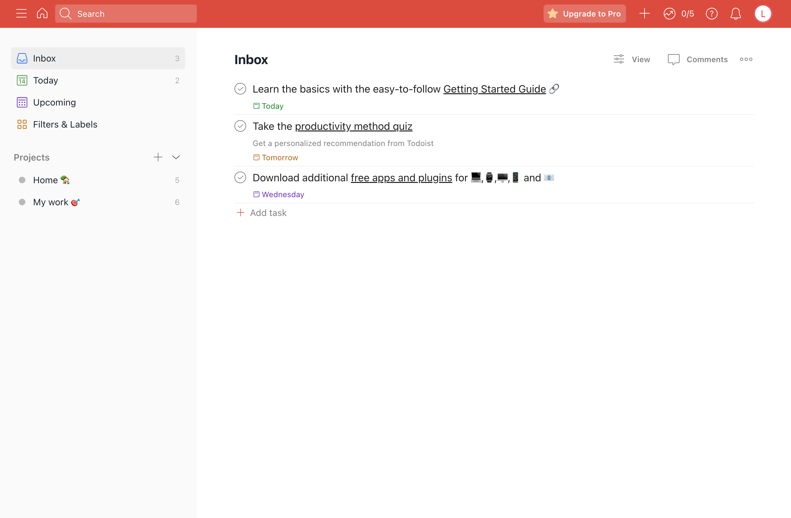
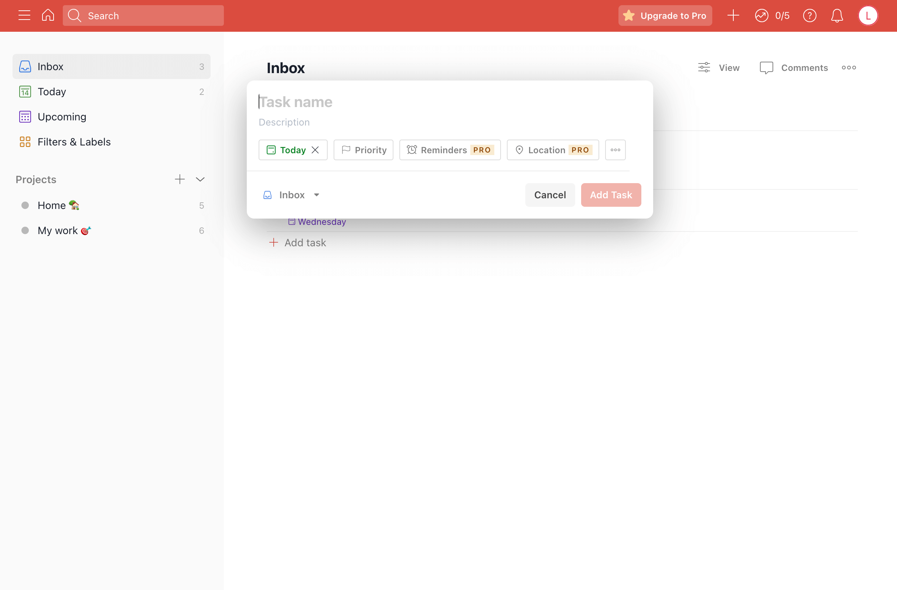

# Todoist clone

Building [Todoist](https://todoist.com) clone using React.js and TypeScript from scratch.

The goal of this project is to demonstrate my understanding of modern web development and code organization, focusing on basic implementation rather than full functionality.

# Technologies

- Scaffold: [create-react-app](https://github.com/facebook/create-react-app)
- State Management: [zustand](https://github.com/pmndrs/zustand)
- UI Component: [chakra-ui](https://github.com/chakra-ui/chakra-ui)
- Styling: Sass / CSS Modules / CSS-in-JS

# Features

Todoist is a quite complex web application, and this project has only implemented the following core features currently:

- Signup / Login / Logout
- Resizable sidebar
- Show todos
- Add todo

# Screenshots

Login page:


Inbox page with sesizable sidebar and todo list:



Add todo modal:



# Running locally

The goal of building this project is to only build the front-end part, then directly request Todist's API through the proxy, and it works.

But Todist uses captcha([Cloudflare Turnstile](https://www.cloudflare.com/en-gb/products/turnstile/?utm_source=turnstile&utm_campaign=widget)) when logging in from July 2023, it's very difficult to log in directly through the proxy now.

In order to be able to run locally, please follow the steps below.

```bash
git clone git@github.com:fe-luna/todoist-clone.git
cd todoist-clone
npm i
npm start
```

Visit <https://todoist.com/auth/login>, run the code in the DevTools to retrieve the captcha:

```js
// Please copy the captcha string manually
document.querySelector("input[name=cf-turnstile-response]").value;
```

Visit <http://localhost:3000/auth/login>, run the code in the DevTools to apply the captcha:

```js
// replace the THE_CAPTCHA_STRING with the conent retrieved previous step
window._captcha = THE_CAPTCHA_STRING;
```

Log in as usual and it should work now.
