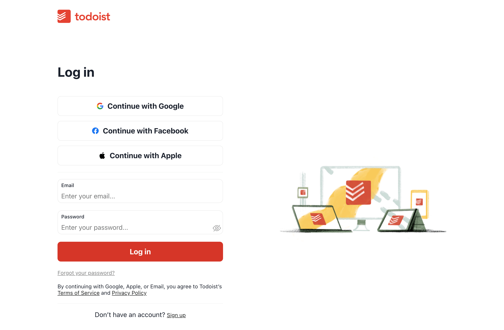

# Todoist clone

Building [Todoist](https://todoist.com) clone using React.js and TypeScript from scratch.

The goal of this project is to demonstrate my understanding of modern web development and code organization, focusing on basic implementation rather than full functionality.

# Technologies

- Scaffold: [create-react-app](https://github.com/facebook/create-react-app)
- State Management: [zustand](https://github.com/pmndrs/zustand)
- UI Component: [chakra-ui](https://github.com/chakra-ui/chakra-ui)
- Styling: Sass / CSS Modules / CSS-in-JS

# Features

Todoist is a quite complex web application, and this project has only implemented the following core features currently:

- Signup / Login / Logout
- Resizable sidebar
- Show todos
- Add todo

# Screenshots

Login page:



Inbox page with sesizable sidebar and todo list:


Add todo modal:


# Running locally

The objective of this project is solely focused on the front-end part, then directly request Todist's API through the proxy, and it works.

You can run locally as follows:

```bash
git clone git@github.com:fe-luna/todoist-clone.git
cd todoist-clone
npm i
npm start
```

The page will open automatically after startup. Enjoy it.
